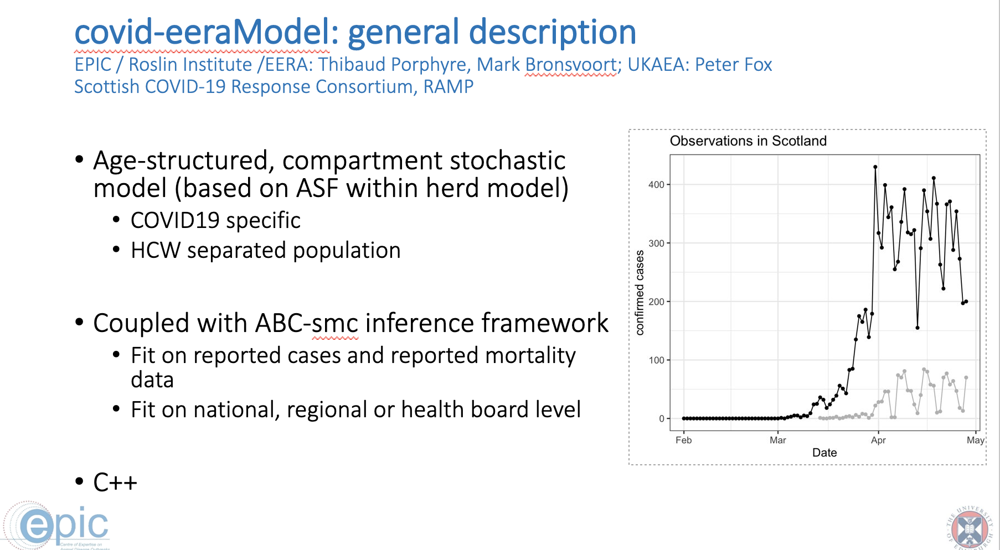
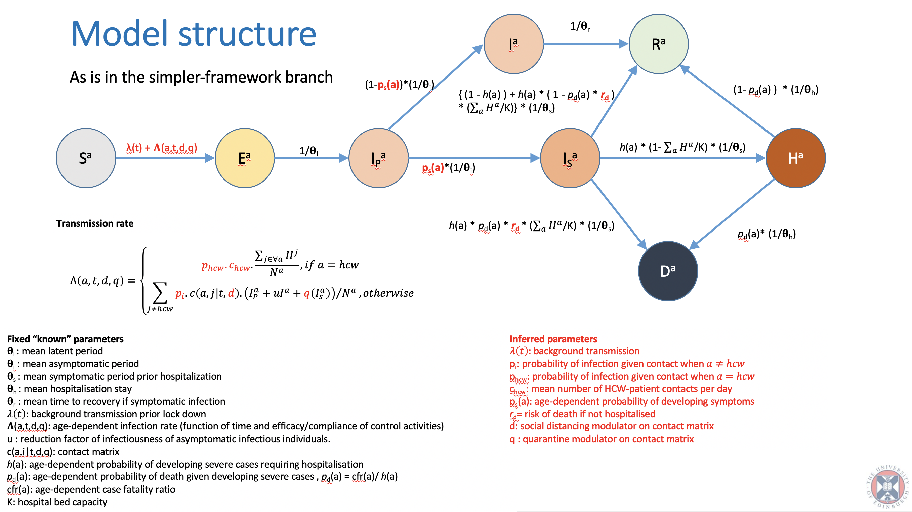
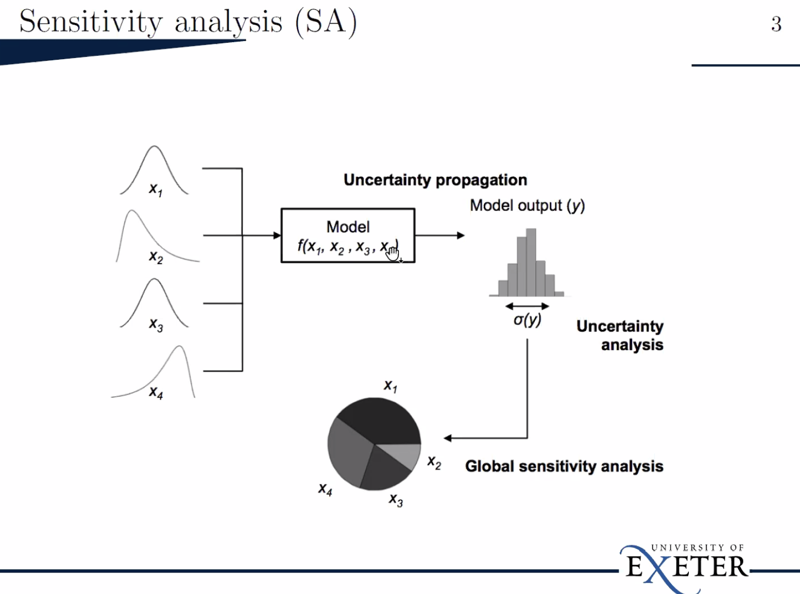
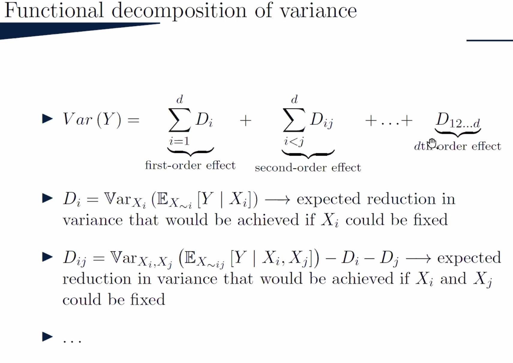
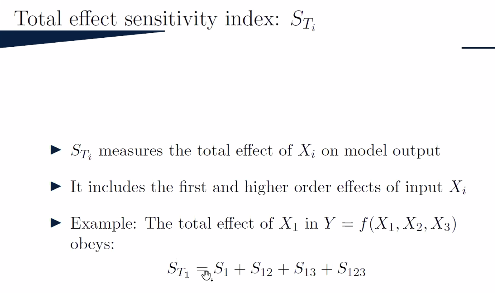
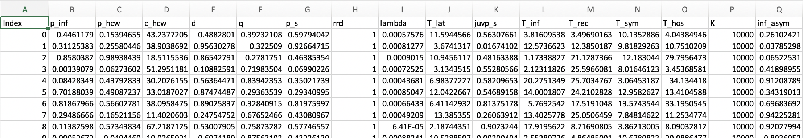
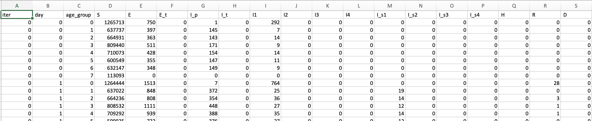

# Planning for Uncertainty Quantification Visualisation

Here are some notes to help with the uncertainty analysis and model evaluation work. 

The model that the Uncertainty Quantification (UQ) team is analysing from an uncertainty perspective is the EERA model:

The details of the model is available on the GitHub repository:  https://github.com/ScottishCovidResponse/Covid19_EERAModel

## Sensitivity Analysis

Here is a high level introduction by Hossain Mohammed from Exeter:

The 2nd order effect is based on the pairwise interactions between the variables while the higher orders account for the higher order interactions.

# Specifics of the data, model and problem 

### Modelling Process 

- (Phase-0) Use an inference process to get estimate rangers for the parameters of interest that would need to be estimated (**Note:** at this stage, we don't work with data from this process)
- Use the ranges of parameters to extract parameter configurations, in this case, we are looking at **160 parameter configurations** 

- For each configuration create multiple runs. In this case, we have **1000 runs** that result in different predictions due to the stochasticity in the model

- For each model run, we have:

  - For each "age_group" (8 age groups)

    - **200 days** of predicted time-series of each compartment in the model:
    - S, E, E_t, I_p, I_t, I1, I2, I3, I4, I_s1, I_s2, I_s3, I_s4, H, R, D (**16 distinct compartment series**)

    

- In total:

  - We have **160** (parameter configurations)  X  **16** (compartments) X **1000** (runs) X **8** (age groups) = **20,480,000** time series of **200 days** each

### Model Parameters:

There is a long list of parameters, some are inferred, some are estimated a priori, and some are fixed across runs. Here are the critical runs:

| **Particle** | **Description**                                            |
| ------------ | ---------------------------------------------------------- |
| nsse_cases   | Normalised sum of square error for the number of cases.    |
| nsse_deaths  | Normalised sum of square error for the number of deaths.   |
| p_inf        | Probability of Infection                                   |
| p_hcw        | Probability of Infection (Healthcare Worker)               |
| c_hcw        | Mean number of Healthcare Worker contacts per day          |
| d            | Proportion of population observing social distancing       |
| q            | Proportion of normal contact made by people self-isolating |
| p_s          | Age-dependent probability of developing symptoms           |
| rrd          | Risk of death if not hospitalised                          |
| lambda       | Background transmission rate                               |
| .....        | .....                                                      |

### Questions to explore

The focus in our case, at least for now, could be to support the **Global Sensitivity Analysis**. However, there is a lot interesting trajectories on the input side.

Some important questions to consider grouped into different areas:

**On model stochasticity:**

​	**Q1:** How does the model outputs vary for a fix set of parameter configuration?

**On model uncertainty in relation to inputs:**

​	**Q2:** How does the variation in the model outputs relate to the parameters of the model? Which parameters are most important or least important?

​	**Q3:** How does the relation between the input parameters and model output variations vary for different models, e.g., for different age groups?

​	**Q4:** What are some second degree and higher degree interactions in relation to the uncertainty?

​	**Q5:** Can we find out more about the nature of the sensitivity -- if you get lower values within the parameters what would be the outcome and/or the characteristics of the uncertainty. 

**On model outcomes and reality:**

​	**Q6:** **History matching** -- how does the model outputs match the reality? (**Note:** This is probably the most common modelling task that can be supported by general visualisations)

### Some generalisable visualisation solutions:

- **Ensemble visualisation:** Multiple time series visualisation - ensemble time-series plot
- **History matching:** matching predictions and observed data to compare the model outcomes and assess quality

